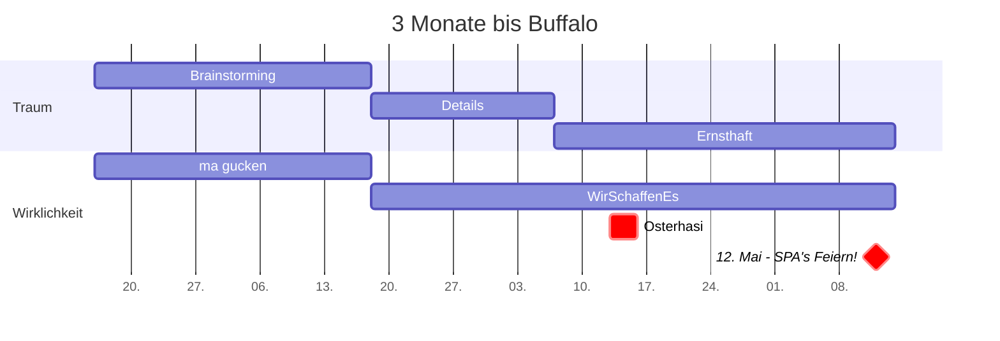

Tag der Pflegenden Angehörigen und Profis
===
Zusammen sind täglich 112 Mio. Tag und Nacht für Pflegebedürftige auf den Beinen - auf Intensiv und zu Hause.

## Table of Contents

[TOC]

## Vorbereitung des 12.5. 

Könnte im besten Fall ein Waking Up für die TWPA Akteure sein. 
Worst Case: nix passiert
:)


Wenn es gut läuft:
- einige Social Media Events am 12.5.
- dabei Hinweise zur TWPA & Akquise
- Öffentlichkeit ein wenig gebrieft

Sonst:
- Benefit für Vorbereitung TWPA ab 4.7.
- noch 2 Monate bis Buffalo  ;)


> I choose a lazy person to do a hard job. Because a lazy person will find an easy way to do it. [name=Bill Gates]


```gherkin=
Feature: Shopping Cart
  As a Shopper
  I want to put items in my shopping cart
  Because I want to manage items before I check out

  Scenario: User adds item to cart
    Given I'm a logged-in User
    When I go to the Item page
    And I click "Add item to cart"
    Then the quantity of items in my cart should go up
    And my subtotal should increment
    And the warehouse inventory should decrement
```

> Read more about Gherkin here: https://docs.cucumber.io/gherkin/reference/

User flows
---
```sequence
Alice->Bob: Hello Bob, how are you?
Note right of Bob: Bob thinks
Bob-->Alice: I am good thanks!
Note left of Alice: Alice responds
Alice->Bob: Where have you been?
```

> Read more about sequence-diagrams here: http://bramp.github.io/js-sequence-diagrams/

3Monatsplan ... und nicht die Lerche!
---


> Read more about mermaid here: http://mermaid-js.github.io/mermaid/

## Appendix and FAQ

:::info
**Find this document incomplete?** Leave a comment!
:::

### Wo kann man einfacher mitschreiben?

-> hier
https://edupad.ch/p/12terMai

###### tags: `Templates` `Documentation`
