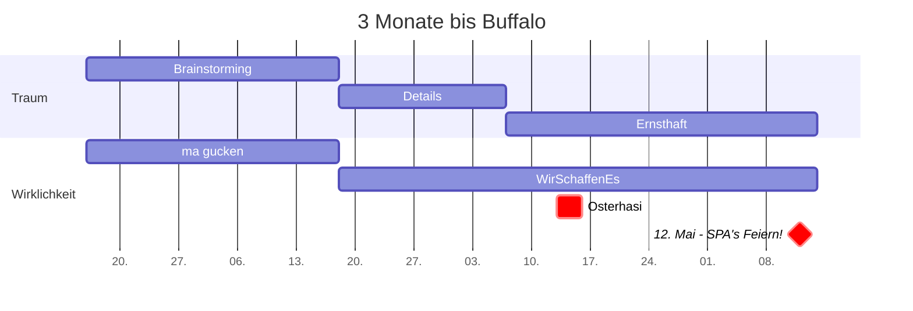

12.5. Tag der Pflegenden Angehörigen und Profis
===
Zusammen sind täglich 112 Mio. Tag und Nacht für Pflegebedürftige auf den Beinen - auf Intensiv und zu Hause.

## Table of Contents

[TOC]

## Vorbereitung des 12.5. 

Könnte im besten Fall ein Waking Up für die TWPA Akteure sein. 
Worst Case: nix passiert
:)

Wenn es gut läuft:
- einige Social Media Events am 12.5.
- dabei Hinweise zur TWPA & Akquise
- Öffentlichkeit ein wenig gebrieft

Sonst:
- Benefit für Vorbereitung TWPA ab 4.7.
- noch 2 Monate bis Buffalo  ;)

> "Pflege wird oft ins Private verschoben" 
[name=Frank Schulz-Nieswandt] 

3Monatsplan ... und nicht die Lerche!
---

## KEIN Schlusswort

> Aber natürlich braucht es um mehr zu erreichen für
die pflegenden Angehörigen auch eine Stimme, die immer wieder den Finger in die Wunde legt, die immer wieder
Ansprüche, Forderungen stellt, aber auf der anderen Seite pflegenden Angehörigen Vorschläge zu unterbreiten, sie
zu schulen, Angebote zu zeigen, … sich gegenseitig zu unterstützen, sich zu vernetzen … [name= Heike Werner, Ministerin ]

## Appendix and FAQ

:::info
**Find this document incomplete?** Leave a comment!
:::

### Wo kann man einfacher mitschreiben? - (Wem das hier zu nerdy erscheint)

-> hier
https://edupad.ch/p/12terMai

###### tags: `Templates` `Documentation`
